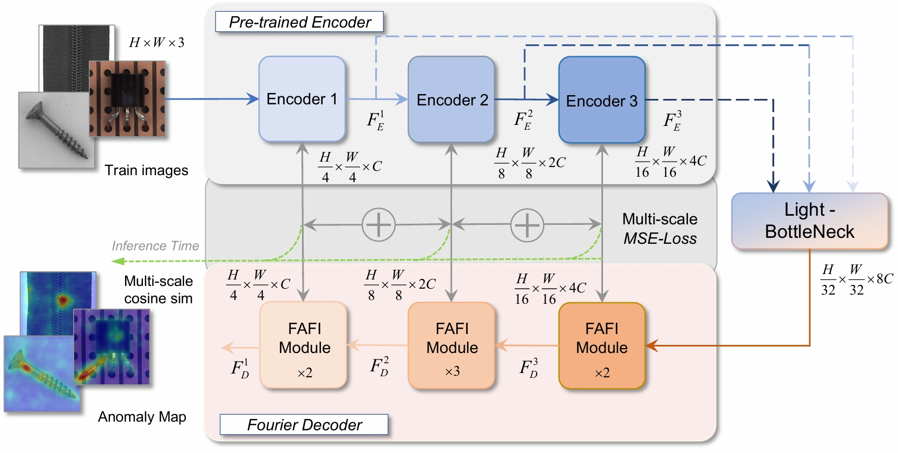
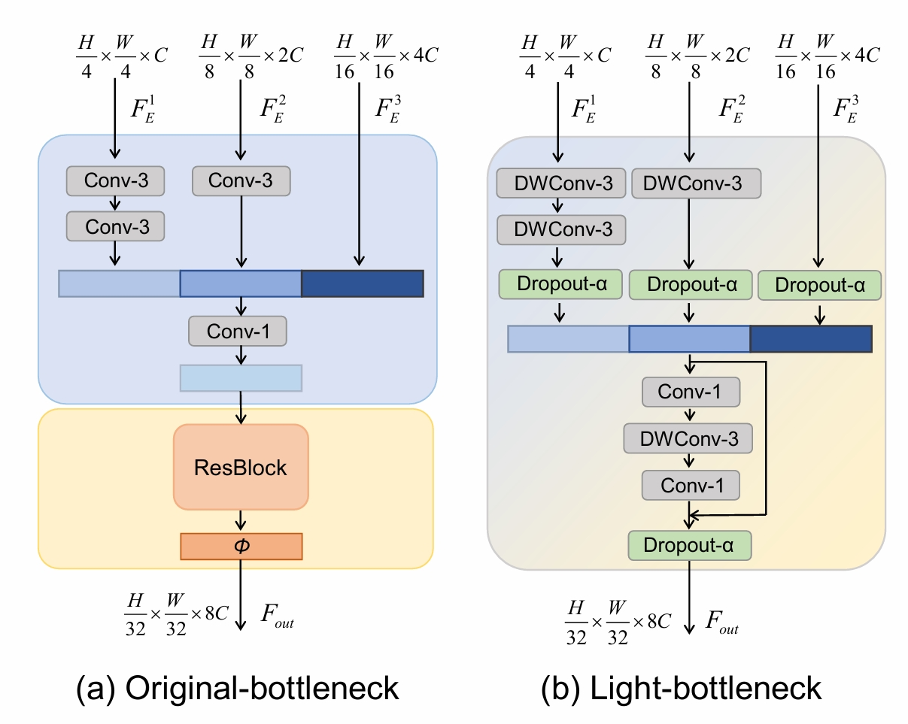
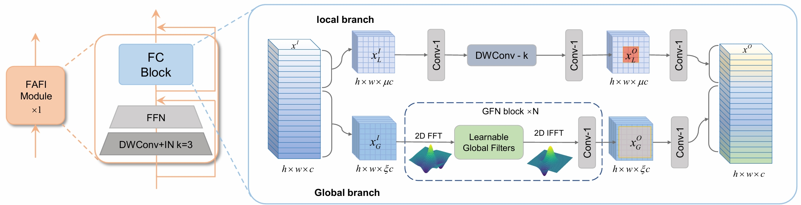
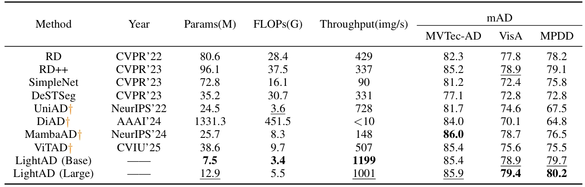
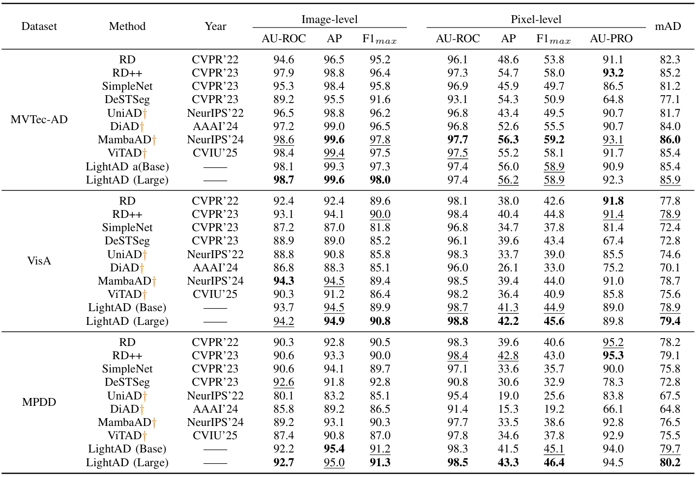
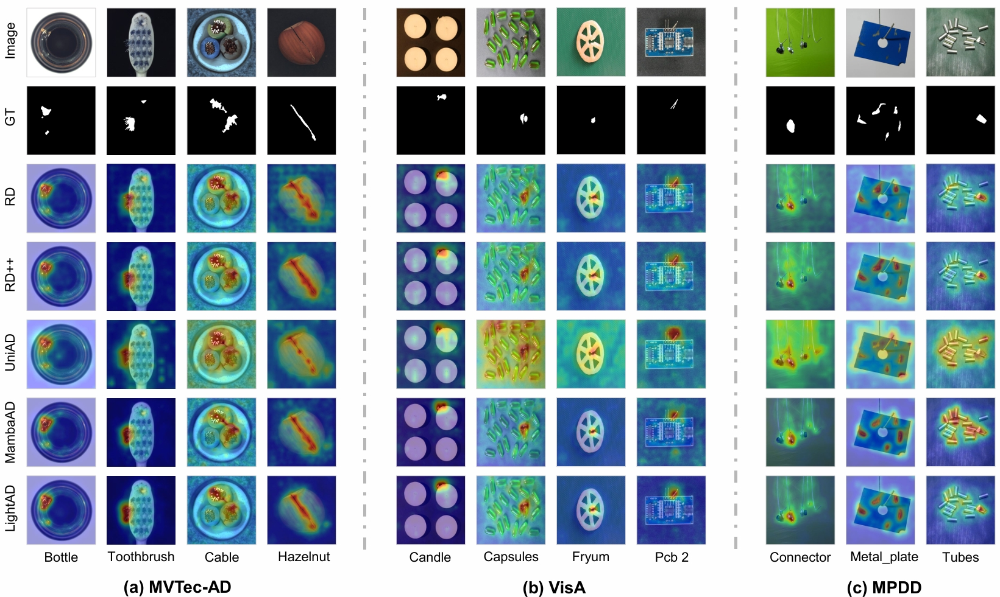

<div align="center">
<h3>LightAD: A Light-weight Model for Multi-class Unsupervised Anomaly Detection</h3>


Liyang Dai<sup>1</sup>, Ruisheng Jia<sup>1</sup>, Xiao Yan<sup>1</sup>, Hongmei Sun<sup>1</sup>

<sup>1</sup>College of Computer Science and Engineering, Shandong University of Science and Technology, Qingdao 266590, China


[[`Paper`]()] 
[[`Project Page`](https://github.com/DLYLab/LightAD)]

Our LigthAD is based on [ADer](https://github.com/zhangzjn/ADer).

</div>

**The model is coming soon**
## Abstract
The task of multi-class unsupervised anomaly detection (MUAD) aims to detect anomalies across multiple categories without requiring any abnormal samples during training, making it highly applicable in real-world scenarios. However, to address the identity mapping problem inherent in MUAD, existing methods often rely on complex architectures and computation-intensive operations, resulting in large model parameters and slow inference speeds. These characteristics hinder their deployment in industrial applications that demand both lightweight models and real-time performance. To alleviate these issues, this article proposes a lightweight multi-class anomaly detection method, termed LightAD, which adopts an asymmetric encoder–decoder structure. To reduce model parameters, a compact pre-trained network is employed as the encoder, and a Light-Bottleneck structure is designed using depthwise separable convolutions. Additionally, Dropout is incorporated to mitigate identity mapping. For efficient inference, a frequency-aware feature interaction (FAFI) module is designed, which employs a dual-branch structure that jointly models global and local information, enabling efficient feature decoding in the frequency domain. Comparative experimental results on three benchmark datasets across seven evaluation metrics demonstrate that LightAD achieves detection performance comparable to state-of-the-art methods, while reducing parameter count by 70% and increasing inference speed by a factor of seven. These results confirm the practical deployment value of LightAD, as it significantly improves efficiency without compromising accuracy.

## Overview
<p align="center">
  
</p>
<p align="center">Overview of the proposed LightAD method. Based on the RD framework, the original multi-scale features from the encoder are first compressed using the Light-BottleNeck. Then, the proposed efficient and effective FAFI module reconstructs the multi-scale features. The aggregated multi-scale reconstruction error is used as the anomaly map during the inference phase.</p>

<p align="center">
  
</p>
<p align="center">Comparison of the Architecture between Original Bottleneck and Light Bottleneck</p>

<p align="center">
  
</p>
<p align="center">Framework diagram of the FAFI module</p>

---

## 🛠️ Getting Started

### Installation
- Clone this repo to [ADer](https://github.com/zhangzjn/ADer).
- Prepare the LightAD extra environment
  ```
    pip install torch==2.2.1 torchvision==0.17.1 torchaudio==2.2.1 --index-url https://download.pytorch.org/whl/cu121
  ```


## 📜 Multi-class Results on Popular AD Datasets

Subscripts `I`, `R`, and `P` represent `image-level`, `region-level`, and `pixel-level`, respectively.

### LightAD-Base Results
|  Method  | mAU-ROC<sub>I</sub> | mAP<sub>I</sub> | m*F*1-max<sub>I</sub> | mAU-ROC<sub>P</sub> | mAP<sub>P</sub> | m*F*1-max<sub>P</sub> | mAU-PRO<sub>R</sub> | mAD  |
|:--------:|:-------------------:|:---------------:|:---------------------:|:-------------------:|:---------------:|:---------------------:|:-------------------:|:----:|
| MVTec-AD |        98.1         |      99.3       |         97.3          |        97.4         |      56.0       |         58.9          |        90.9         | 85.4 |
|   VisA   |        93.7         |      94.5       |         89.9          |        98.7         |      41.3       |         44.9          |        89.0         | 78.9 |
|   MPDD   |        92.2         |      95.4       |         91.2          |        98.3         |      41.5       |         45.1          |        94.0         | 79.7 |

### LightAD-Large Results
|  Method  | mAU-ROC<sub>I</sub> | mAP<sub>I</sub> | m*F*1-max<sub>I</sub> | mAU-ROC<sub>P</sub> | mAP<sub>P</sub> | m*F*1-max<sub>P</sub> | mAU-PRO<sub>R</sub> | mAD  |
|:--------:|:-------------------:|:---------------:|:---------------------:|:-------------------:|:---------------:|:---------------------:|:-------------------:|:----:|
| MVTec-AD |        98.7         |      99.6       |         98.0          |        97.4         |      56.2       |         58.9          |        92.3         | 85.9 |
|   VisA   |        94.2         |      94.9       |         90.8          |        98.8         |      42.2       |         45.6          |        89.8         | 79.4 |
|   MPDD   |        92.7         |      95.0       |         91.3          |        98.5         |      43.3       |         46.4          |        94.5         | 80.2 |


## Main results

<p align="center">

  
  
</p>

## visualization

<p align="center">
  
</p>

## Citation
If you find this code useful, don't forget to star the repo and cite the paper:
```

```
## Acknowledgements
We thank the great works [ADer](https://github.com/zhangzjn/ADer), [MambaAD](https://lewandofskee.github.io/projects/MambaAD/) for providing assistance for our research.

